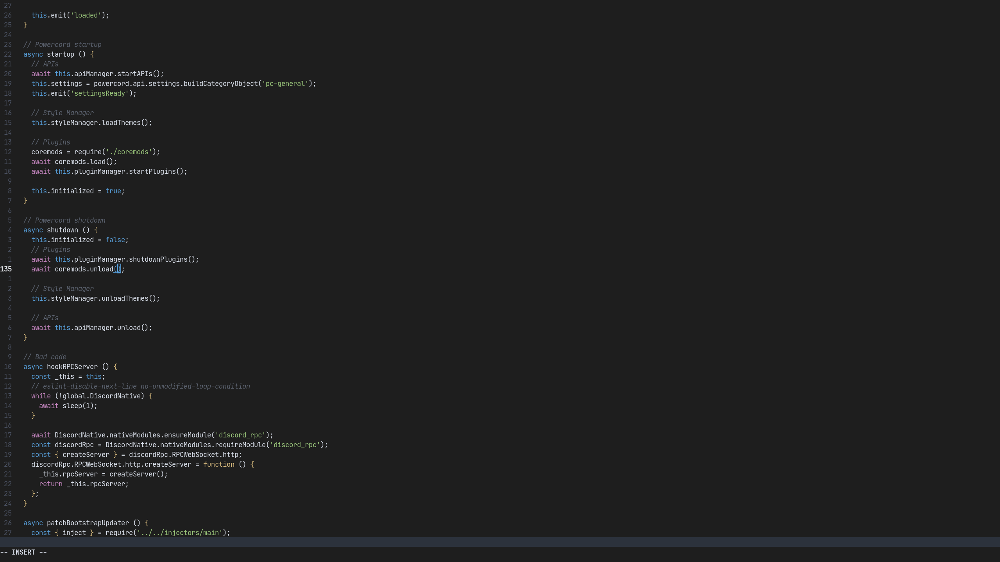

# Hec's Vim Colorscheme



## Credit

I used [This script](https://github.com/felipec/vim-felipec) to generate my colorscheme.

## Installing

With `vim-plug`

```viml
Plug 'hecknt/hec-color-scheme.vim'
```
